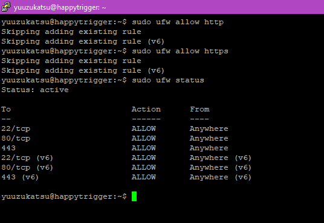
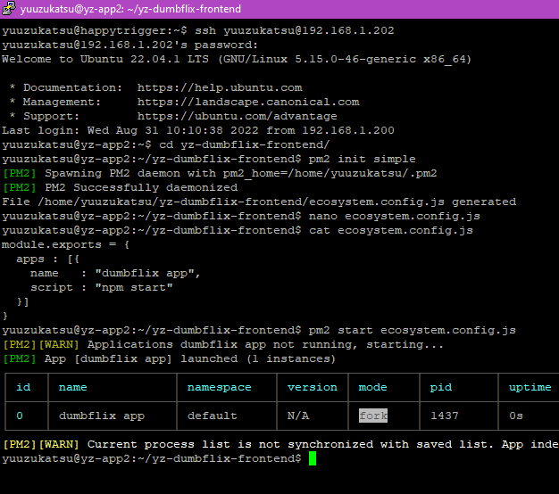

# Day 7

# Web Server & Load Balancing

## Definisi Web Server

Web Server merupakan service yang berfungsi untuk melayani dan memproses
request HTTP

## Instalasi Nginx

### Step 1

Lakukan instalasi `nginx` dengan command

```
sudo apt-get install nginx
```

 

### Step 2

Cek status nginx, pastikan sudah berjalan dengan command

```
systemctl status nginx.service
```

atau

```
service nginx status
```

 

### Step 3

Jika menggunakan `ufw`, pastikan untuk allow port dengan command berikut

```
sudo ufw allow http
sudo ufw allow https
```

 

## Konfigurasi Reverse Proxy dan Load Balancer dengan 3 server

Aplikasi node.js sudah berjalan di 2 server lain dengan aplikasi yang
sama, server app 1 berjalan di ip `192.168.1.201` port `3000` dan server app
2 berjalan di ip `192.168.1.202` port `3000`



 

### Step 1

Buka directory `/etc/nginx` lalu buat 2 file berakhiran `.conf`
```
cd /etc/nginx
sudo mkdir yz-app
sudo chown <your-username> yz-app/
touch yz-app/loadbalance.conf yz-app/reverseproxy.conf
```
 

### Step 2

Edit file `reverseproxy.conf` dan isikan berikut

```
server {
    server_name dumbways.xyz;
    location / {
        proxy_pass http://192.168.1.201:3000;
    }
} 
```
 

### Step 3

Edit file `loadbalance.conf` dan isikan berikut
```
upstream loadbalance {
    server 192.168.1.201:3000;
    server 192.168.1.202:3000;
}

server {
    server_name loadbalance.dumbways.xyz;
    location / {
        proxy_pass http://loadbalance;
    }
}
```
 

### Step 4

Buka file `/etc/nginx/nginx.conf` lalu tambahkan line berikut
```
include /etc/nginx/yz-app/.conf;
```
 

### Step 5

Cek konfigurasi nginx sudah benar dengan command berikut :
```
sudo nginx -t
```
 

### Step 6

Lakukan restart service nginx
```
sudo systemctl restart nginx
```
atau
```
sudo service nginx restart
```
 

### Step 7

Dari sisi client, tambahkan line berikut di file /etc/hosts. Jika
menggunakan windows tambahkan di file
`C:\Windows\System32\drivers\etc\hosts`
```
192.168.1.200 loadbalance.dumbways.xyz
192.168.1.200 dumbways.xyz
```
 

### Step 8

Buka domain dari browser

 

 
